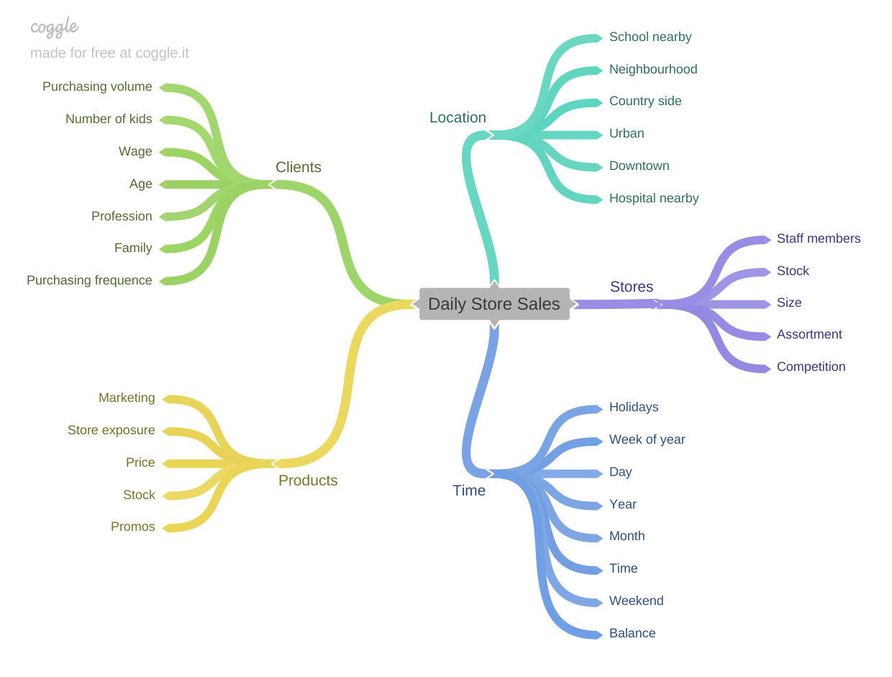

# Rossmann stores - 6 weeks sales forecast

This project contains data shared in the competition "Rossmann Store Sales" hosted by Kaggle, available [here](https://www.kaggle.com/c/rossmann-store-sales).

## Problem to be solved 

Rossmann operates over 3,000 drug stores in 7 European countries. Currently, Rossmann store managers are tasked with predicting their daily sales for up to six weeks in advance. Store sales are influenced by many factors, including promotions, competition, school and state holidays, seasonality, and locality. With thousands of individual managers predicting sales based on their unique circumstances, the accuracy of results can be quite varied. Thus, a unified solution proposing a general method to predict sales for the next six weeks; is required. 

## Used Approach

The CRoss-Industry Standard Process for data mining (CRISP) methodology was used. This is, the life cycle of the project is given by the following figure. 

## Data General Overview
Several stages were considered for this project in terms of data preparation: 

1. To collect and understand the data
2. Cleaning the database
3. Handling  missing values

Some highlighted elements: 
1. 1017209 sales records 
2. 1115 different stores
3. Some variables: "date", "store_type", "customers", "assortment", "school_holiday", "open", "promo2", "sales", among others. 

As the main aim of the project is to provide forecasted values, not available features at the time of the forecast were not considered. 

## EDA and Insights Finding

Once some basic understanding of the data and the business problem were gained (see figure below), an Exploratory Data Analysis (EDA) was performed. To provide a path for such EDA, some hypothesis were proposed, and listed below. 

1. Stores with a larger assortment should sell more
2. Stores with closer competitors should sell less
3. Stores with longer-standing competitors should sell more
4. Stores where products cost less for longer (active promotions) should sell more
5. Stores with more promotion days should sell more
6. Stores with more extended promotions should sell more
7. Stores open during Christmas holiday should sell more
8. Stores should sell more over the years
9. Stores should sell more in the second half of the year
10. Stores should sell more after the 10th day of each month
11. Stores should sell less on weekends
12. Stores should sell less during school holidays
13. Stores that open on Sundays should sell more

## Data preparation (standardization and feature selection)

Once EDA was performed, some basic transformations were made in order to have better data to input into the models. Some of the big ideas in this phase: 
- All information being imputed to the model is goint to be numerical, so the model optimization process would carry out. 
- Selection on how to scale variables is based on the presence of outliers: Robust Scaler for variables displaying more and more extreme values and MinMax Scaler for other variables.
- Variables referring to time such as day of week, week of year, etc, would be coded as a ciclycal variables using sin and cos. 
- Response variable was transformed with a log() function. 
- As no normal distribution was encounter, no standarization process was carried out. 

Finally, for the feature selection, aside from the knwoledge gained in the EDA phase and hypothesis addressing process, Boruta algorithm was used (more information [here](https://towardsdatascience.com/boruta-explained-the-way-i-wish-someone-explained-it-to-me-4489d70e154a)). As Boruta algorith relies greatly on Random Forest, it might not be the fastest algorithm to be implemented, but it worth it as it provides a very reasonable set of variables intuitively assesed to be used. 

## Machine learning modeling
Linear regression, Regularized linear regression - lasso, Random forest and XGBoost models were implemented and assessed based on a cross-validation approach (described [here](https://machinelearningmastery.com/k-fold-cross-validation/)). This is, all dataset is going to be split in 5 groups (each one containing 20% of the data) where each of the five iterations would have a different group as testing data while the remaining of the data would be training data. Goodness of fit metrics would be averaged to have a global metric of models. 

 Mean Absolute Error (MAE), Mean absolute percentage error (MAPE) and Root Mean Square Error (RMSE) results were:

| Model | MAE |MAPE |RMSE |
| --- | --- | --- | --- |
|Random forest regressor | 	836.61 +/- 217.1	| 0.12 +/- 0.02|	1254.3 +/- 316.17|
|XGBoost regressor | 853.71 +/- 257.13	 |0.12 +/- 0.03|1297.01 +/- 400.11 |
|Linear regression | 2081.73 +/- 295.63 |0.3 +/- 0.02|	2952.52 +/- 468.37 |
|Regularized linear regression | 2116.38 +/- 341.5	 |0.29 +/- 0.01	|3057.75 +/- 504.26 |

Although the random forest model outperformed the other models, XGBoost was selected for further development (parameter tuning and deployment). The rationale behind this decision is based on the resources available for this project as XGBoost is considerably lighter and easier to implement in production than the random forest. 

## Hyperparameter tuning

After selecting the XGBoost model, a random search procedure was implemented in order to get the best possible model out of the XGBoost category. For this, a grid of potential values for the parameter model (n_estimators, eta, max_depth, subsample, colsample_bytree and min_child_weight, see [here](https://xgboost.readthedocs.io/en/stable/parameter.html9) for more) was assessed. After a extensive search process, an adequate set of parameters was found and implemented. The final model displayed the following goodness of fit metrics. 

| Model | MAE |MAPE |RMSE |
| --- | --- | --- | --- |
|XGBoost regressor  | 853.71 +/- 257.13	 |0.3 +/- 0.02|2952.52 +/- 468.37|

## Business performance
Overall and based on the shape of error and further analysis made on the notebook, the model performed well. 

As improvement is always achivable and using the CRISP approach, a new cycle including further ideas as new models, new measures, new features, etc., could be put in place. 
Now, considering the encountered limitations in tech resources, this iteration will remain as final, at least for the time being. Heavy or lengthy solutions are not preferred, even if it performs exceptionally well. Such trade-off could be assessed with a company's management in order to scale solutions.

## Model in production
Final model was deployed and can be accessed through a Telegram chatbot. Besides the trained model, the following were created: i) an object class (Rossmann) aimed to deal with the data processing pipeline, ii) an API handler to bridge the conextion between the classes and the chatbotand, and iii) an app to manage messages. All files were hosted on Heroku (https://www.heroku.com/).

The following scheme represents all these files.

You are more than welcome to try it out! chatbot id: @sebmatecho_bot
